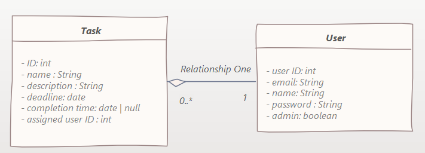

# Rendszerspecifikáció

## A rendszerrel szemben támasztott követelmények
- A rendszer funkcióit csak bejelentkezett felhasználó használhatja
- Webes felület

## Funkcionális követelmények
### Adminisztrátor által elérhető funkciók
- Új feladatok létrehozása a dolgozók számára
- Minden feladat módosítása, törlése
- Dolgozók feladatainak megtekintése
- Új dolgozó hozzáadása
- Dolgozó módosítása, törlése
- Minden dolgozó statisztikájának megjelenítése

### Dolgozóként és adminisztrátorként is elérhető funkciók
- Saját feladatok listájának lekérése
- Saját feladatok megjelölése készként
- Létrehozott feladatok módosítása/törlése
- Saját statisztika megjelenítése
- Feladatok szűrése
- Feladatok megjelenítése naptár nézetben
- Beállítások megjelenítése és módosítása

## Felülettel szemben támasztott követelmények

## Rendszer architektúra modell

## Adatbázis terv

### Adatbázis modell

### SQL Séma

### Users tábla

A Users tábla tárolja a felhasználók adatait .

| Oszlop név | Adat típus | Not null | Leírás                   |
|------------|------------|----------|--------------------------|
| UserId     | Integer    |    true      | Felhasználó azonosítója. |
| Email      | VARCHAR    |          | Felhasználó email címe.  |
| Username   | VARCHAR    |    true       | Felhasználó neve.        |
| Password   | VARCHAR    |    true       | Felhasználó jelszava     |
| IsAdmin    | VARCHAR    |          | Felhasználó admin-e?     |

### Tasks tábla

A Tasks tábla a feladatok adait tárolja.

| Oszlop név | Adat típus | Not null | Leírás                   |
|------------|------------|----------|--------------------------|
| TaskID    | Integer    |    true      | Feladat azonosítója. |
|  TaskName  |  VARCHAR |          |  Feladat neve. |
|  TaskDescription  | VARCHAR   |          |  Feladat leírása.   |
|  DueDate |  DATE  |          |  Feladat teljesítési határideje.   |
|   IsPastDueDate | BOOLEAN   |          | Feladatnak elmúlt-e a határideje.    |
|   IsDone  |  BOOLEAN    |          | Feladat kész e van.    |
|   AssignedUserId | Integer   |          |   Feladathoz rendelt felhasználó  |
|   CreatedBy | Integer    | true   | Feladatot létrehozó felhasználó.    |
|   LastModification |  DATE  |          | Feladat utólsó módosításának dátuma.    |